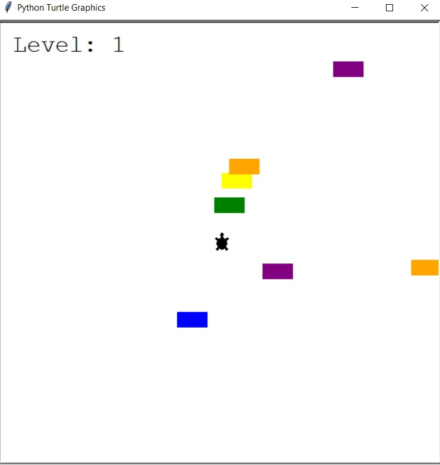
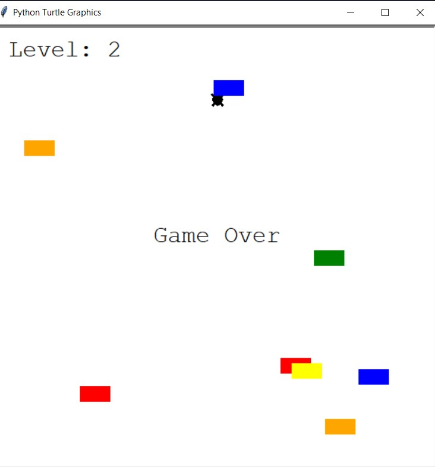

## Introduction

This is a Python project that implements a fun game called "Turtle Crossing." The game is a simple 2D game where a turtle has to cross a busy street without getting hit by passing cars. The goal is to safely navigate the turtle to the other side of the road.

    
    
Description: This screenshot shows the Turtle Crossing Game in action.

    
    
Description: This screenshot shows the "Game Over" screen.

